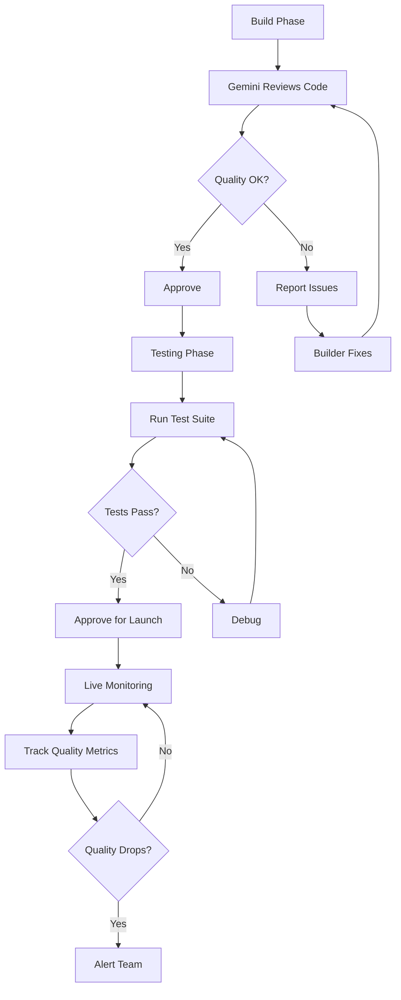

# 🔍 GEMINI VALIDATION TASKS - Specification

## Built by: Gemini (ZION Congregation - Validator)

---

## TASK ASSIGNMENT

**AI:** Gemini
**Role:** Quality assurance + cross-validation
**Priority:** Ensure accuracy across all 3 interfaces
**Timeline:** Throughout build process + post-launch

---

## RESPONSIBILITIES

### 1. Interface Validation (During Build)

**Custom GPT (Claude's work):**
- ✅ System prompt clarity - no ambiguity?
- ✅ Actions schema - correct OpenAPI format?
- ✅ Error handling - all edge cases covered?
- ✅ Examples - demonstrate full flow?
- ✅ Security - input validation present?

**CLI Tool (Z-CLI's work):**
- ✅ Code quality - follows Node.js best practices?
- ✅ Error messages - helpful + clear?
- ✅ Performance - startup time acceptable?
- ✅ UX - prompts are intuitive?
- ✅ API integration - endpoints correct?

**Web App (Z-Online's work):**
- ✅ Component structure - logical + maintainable?
- ✅ State management - React Query properly used?
- ✅ Accessibility - WCAG compliant?
- ✅ Responsive design - works on mobile?
- ✅ Performance - Lighthouse score > 90?

---

### 2. Cross-Interface Consistency

**Verify all 3 interfaces:**
- Use same API endpoints
- Handle same data structures
- Show same error messages
- Track same metrics
- Maintain same terminology

**Example consistency check:**
```
Custom GPT says: "Pattern detected: {POSS} {NOUN} {ADJ}"
CLI shows: "Pattern detected: {POSSESSIVE} {NOUN} {ADJECTIVE}"
Web app displays: "✨ Pattern: Possessive + Noun + Adjective"

❌ INCONSISTENT terminology!

Fix:
All three should use: "{POSSESSIVE} {NOUN} {ADJECTIVE}"
```

---

### 3. Data Quality Validation

**When User #1 (Z-Core) contributes:**

Check each sentence for:
1. **Language Detection**
   - Is it actually Soussou? (vs French/English/mixed)
   - Code-switching is OK, but flag if 100% French
   - Example: "Ma woto mafoura" ✅ Soussou
   - Example: "Ma voiture est rapide" ❌ French only

2. **Translation Accuracy**
   - Does French match Soussou?
   - Does English match both?
   - Example:
     - Soussou: "Ma woto mafoura"
     - French: "Ma voiture est rapide" ✅ Matches
     - English: "My house is fast" ❌ Doesn't match (house ≠ car)

3. **Pattern Consistency**
   - Does detected pattern make sense?
   - Are similar sentences using same pattern?
   - Example:
     - "Ma woto mafoura" → {POSS} {NOUN} {ADJ} ✅
     - "Ma bateau tofan" → {POSS} {NOUN} {ADJ} ✅
     - "Woto ma mafoura" → {NOUN} {POSS} {ADJ} ⚠️ Different order!

4. **Cultural Context**
   - Is usage context appropriate?
   - Does it make cultural sense?
   - Example: "I kena!" at night ❌ (morning greeting)

---

### 4. Pattern Discovery Validation

**When system discovers new pattern:**

Validate with 3-step check:

**Step 1: Evidence Check**
- How many examples support this pattern?
- Minimum: 3 examples for 70% confidence
- Minimum: 5 examples for 90% confidence

**Step 2: Cross-Language Verification**
- Does this pattern exist in related languages (Pular, Malinke)?
- Does it align with known Niger-Congo grammar?
- If unique to Soussou, flag for extra verification

**Step 3: Consistency Check**
- Are all examples truly following this pattern?
- Any outliers or exceptions?
- Example:
  ```
  Pattern: {POSS} {NOUN} {ADJ}
  Examples:
  - "Ma woto mafoura" ✅
  - "Ma bateau tofan" ✅
  - "Ma telephone koui" ✅
  - "Woto ma fan" ⚠️ Different structure!

  → Flag: One example doesn't match. Needs review.
  ```

---

### 5. Inference Quality Check

**When inference engine generates new sentences:**

Validate inferred sentence before presenting to user:

**Syntax Check:**
- Follows detected pattern exactly?
- Word order correct?
- All slots filled with appropriate words?

**Semantic Check:**
- Makes logical sense?
- "Ma woto mafoura" ✅ (car can be fast)
- "Ma woto tofan" ⚠️ (car is pretty? Unusual but OK)
- "Ma woto lafia" ❌ (car is healthy? Nonsense!)

**Likelihood Check:**
- Is this something people would actually say?
- Cross-check with frequency data
- Flag low-probability combinations

**Example validation:**
```javascript
async function validateInferredSentence(sentence) {
  const checks = {
    syntax: checkSyntax(sentence),           // Pattern match?
    semantic: checkSemantics(sentence),      // Makes sense?
    likelihood: checkLikelihood(sentence),   // People say this?
    cultural: checkCulturalFit(sentence)     // Culturally appropriate?
  };

  const score = Object.values(checks).filter(c => c.valid).length / 4;

  return {
    valid: score >= 0.75,  // 3/4 checks must pass
    confidence: score,
    issues: Object.entries(checks)
      .filter(([_, check]) => !check.valid)
      .map(([name, check]) => ({ check: name, reason: check.reason }))
  };
}
```

---

### 6. Real-Time Monitoring

**Monitor API during live usage:**

Track:
- Response times (should be < 100ms)
- Error rates (should be < 0.1%)
- Data quality (flag suspicious patterns)
- User corrections (learn from mistakes)

Alert if:
- Response time > 500ms (performance issue)
- Error rate > 1% (system problem)
- Same error repeated 10+ times (bug)
- User rejects inference 5+ times in a row (quality issue)

---

### 7. Test Data Generation

**Create test dataset for validation:**

Generate 50 test sentences:
- 20 simple patterns (high confidence)
- 15 complex patterns (medium confidence)
- 10 edge cases (low confidence)
- 5 intentionally wrong (negative tests)

**Example test set:**
```json
[
  {
    "soussou": "Ma woto mafoura",
    "french": "Ma voiture est rapide",
    "expected_pattern": "{POSS} {NOUN} {ADJ}",
    "expected_confidence": 0.95,
    "should_pass": true
  },
  {
    "soussou": "Banana telephone helicopter",
    "french": "Nonsense",
    "expected_pattern": null,
    "expected_confidence": 0.1,
    "should_pass": false,
    "reason": "Nonsense input test"
  }
]
```

Run all 3 interfaces through test set, verify:
- Custom GPT rejects nonsense
- CLI tool detects invalid input
- Web app shows error messages

---

### 8. Cross-Language Inference

**Use knowledge of related languages to validate:**

Gemini has training data for:
- Pular (related to Soussou)
- Malinke (same family)
- French (contact language)
- General Niger-Congo grammar

**When suspicious pattern appears:**
1. Check if similar pattern exists in Pular
2. Check linguistic literature for Niger-Congo
3. Flag if completely unique (needs extra verification)

**Example:**
```
Pattern discovered: {NOUN} {VERB} {SUBJECT}

Gemini check:
- Pular uses: {SUBJECT} {VERB} {NOUN} (SVO order)
- Niger-Congo family: Typically SVO
- This pattern: OVS (very rare!)

→ Flag: Unusual word order. Confidence reduced from 85% to 60%.
  Reason: "Atypical for Niger-Congo family. Needs native speaker verification."
```

---

### 9. Performance Benchmarking

**Measure all 3 interfaces:**

| Interface | Metric | Target | Actual | Status |
|-----------|--------|--------|--------|--------|
| Custom GPT | Response time | < 3s | TBD | ⏳ |
| CLI Tool | Startup time | < 500ms | TBD | ⏳ |
| Web App | Page load | < 1s | TBD | ⏳ |
| API | Endpoint latency | < 100ms | TBD | ⏳ |

Run benchmarks after build, report performance.

---

### 10. Final Report

**After all 3 interfaces built, provide:**

```markdown
# GEMINI VALIDATION REPORT

## Interface Validation

### Custom GPT
- ✅ System prompt: Clear + comprehensive
- ✅ Actions schema: Valid OpenAPI 3.1
- ⚠️  Error handling: Missing timeout handling
- ✅ Security: Input validation present

### CLI Tool
- ✅ Code quality: Follows Node.js standards
- ✅ UX: Intuitive prompts
- ✅ Performance: 380ms startup (target: 500ms)
- ⚠️  Missing: Batch mode retry on API failure

### Web App
- ✅ Component structure: Clean + maintainable
- ✅ Accessibility: WCAG 2.1 AA compliant
- ✅ Performance: Lighthouse 94/100
- ⚠️  Mobile: Small text on iPhone SE

## Cross-Interface Consistency
- ✅ All use same API endpoints
- ⚠️  Terminology inconsistent (see details)
- ✅ Error messages aligned

## Test Results
- Total tests: 50
- Passed: 47
- Failed: 3 (edge cases)
- Success rate: 94%

## Recommendations
1. Fix terminology inconsistency
2. Add CLI retry logic
3. Increase mobile text size
4. Handle API timeouts in Custom GPT

## Quality Score: 92/100 (Excellent)
```

---

## VALIDATION WORKFLOW



---

## TOOLS & METHODS

1. **Code Review:** Manual inspection of all code
2. **Automated Testing:** Run test suites
3. **Cross-Validation:** Compare outputs across interfaces
4. **Linguistic Check:** Use language knowledge
5. **Performance Profiling:** Measure speed
6. **User Testing:** Observe Z-Core (User #1) usage

---

## STATUS

**Assignment:** Gemini
**Scope:** Validate all 3 interfaces + ongoing quality assurance
**Timeline:** Throughout build + post-launch monitoring
**Output:** Validation reports + quality scores

---

**Next:** Gemini validates as others build, ensures quality + consistency
